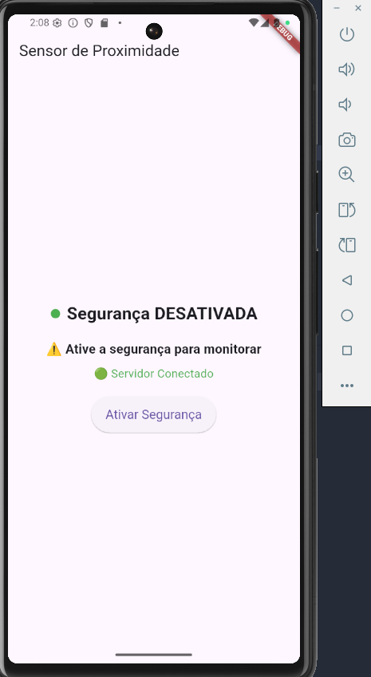
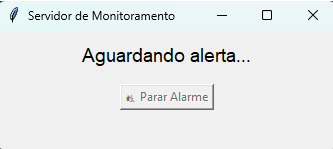

# 🔐 Sistema de Alarme com Sensor de Proximidade

Este projeto foi desenvolvido para simular um sistema de alarme, utilizando Flutter no aplicativo mobile e Python com Flask-SocketIO no servidor. O sistema é capaz de detectar proximidade via sensor do celular, capturar uma imagem e tocar um alarme no servidor.

---

## 📥 **Tecnologias utilizadas**
- 📱 **Flutter (Mobile)**
- 🐍 **Python**
- 🧠 **Flask + Socket.IO**
- 🔉 **pygame**
- 📷 **camera + proximity_sensor**
- 🧰 **Tkinter**

---

## 📥 **Como executar**

### 🔧 **Requisitos**
Certifique-se de ter instalado:
- ✅ **Python 3.8+**
- ✅ **Flutter**
- ✅ **Android Studio (ou emulador/dispositivo físico)**

---

### 🖥 **Servidor**

### 1️⃣ **Clone o repositório**
```bash
git clone https://github.com/melissaoalves/sensors-sd.git
cd sensors-sd/server
```

### 2️⃣ **Crie um ambiente virtual** 
```bash
python -m venv venv
source venv/bin/activate  # Linux/macOS
venv\Scripts\activate      # Windows
```

### 3️⃣ **Instale as dependências**
```bash
pip install -r requirements.txt
```

### 4️⃣ **Execute o servidor**  
   ```bash
   python server.py
   ```

### 📱 **Aplicativo**

### 1️⃣ **Acesse a pasta do app Flutter**
```bash
cd ..
```

### 2️⃣ **Instale os pacotes** 
```bash
flutter pub get
```

### 3️⃣ **Rode em um dispositivo/emulador**
```bash
flutter run
```

## 🎮 **Funcionalidades**
✅ **Detecção de proximidade com sensor**  
✅ **Captura e envio de imagem ao servidor**  
✅ **Alarme sonoro remoto (servidor)**  
✅ **Botão no servidor para desativar o alarme**  
✅ **Interface visual no aplicativo com status de segurança**  

---

## 📸 *Prints da Interface*
### 🔹 *Aplicativo - Modo de Segurança Desativado*


### 🔹 *Aplicativo - Modo de Segurança Ativado*


### 🔹 *Servidor*


---

## 👨‍💻 **Autores**
**Davi Rodolfo e Melissa Alves**
  